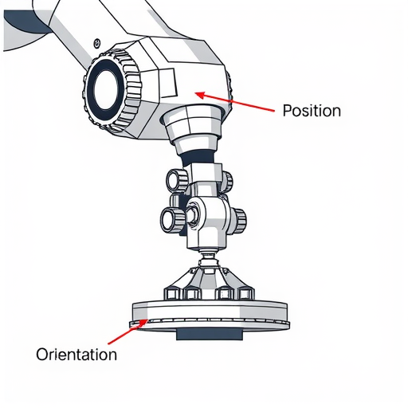

<!--
author:   Marco Hamann

email:    marco.hamann@htw-dresden.de

version:  0.0.1

language: de

comment:  Dieser Kurs richtet sich an Studierende der Hochschule für Technik und Wirtschaft Dresden im Masterstudiengang Angewandte Robotik im 2. Semester.

import: https://raw.githubusercontent.com/LiaScript/CodeRunner/master/README.md

persistent: true

-->

# Räumliche Kinematik

## Einstieg

### Motivation

---

Beschreibung von **Positionen** im dreidimensionalen Raum, z. B.:

* Wo ist das Werkstück?
* Wie berechnet ein industrieller Roboterarm die Position eines Teils, das er aufnehmen soll, beispielsweise für die präzise Montage, das Schweißen oder das Verpacken?
* Wie bestimmt ein kollaborierender Roboter seine Position relativ zu menschlichen Arbeitskollegen, beispielsweise in der Mensch-Maschine-Kollaboration?
* Mathematisch: relativ zu welchem Koordinatensystem? .. relativ zum Basiskoordinatensystem des Endeffektor bzw. zum Weltkoordinatensystem?

---

Beschreibung von **Orientierungen** im dreidimensionalen Raum

* In welche Richtung kann ein Werkstück von einer Unterlage aufgenommen bzw. auf diese abgelegt werden?
* Wie ermittelt ein autonomes Fahrzeug seine Fahrtrichtung, um sicher durch den Verkehr zu navigieren?
* Wie bestimmt ein Roboterarm die Ausrichtung seiner Greifhand, beispielsweise für eine präzise Montage oder den Zusammenbau von Teilen?
* Wie passt ein Coboter seine Ausrichtung an, um sicher mit menschlichen Arbeitskollegen zusammenzuarbeiten?
* Mathematisch: Ausrichtung zwischen Koordinatensystemen

---

<div style="width: 100%; max-width: 1335px; margin: 0 auto; padding: 0; box-sizing: border-box; display: block;">
  <div style="position: relative; width: 100%; height: 0; padding-bottom: 51.78%; /* 479 / 925 ≈ 51.78% */">
    
  </div>
</div>

<p>
  <strong>Abbildung:</strong> Technische Darstellung eines Endeffektors (Greifer), der ein Werkstück von oben greift. Der Begriff 'Position' ist am Anschlusspunkt am Manipulatorarm markiert. Die 'Orientierung' des Greifers ist durch die Griffrichtung "von oben" dargestellt.
</p>

---

<!-- style="color: purple;"-->
Wir benötigen ein ein **mathematisches Verfahren**, um Positionen (Translationen) und Orientierungen (Rotationen) zu beschreiben.

---

### Was ist Kinematik?

---

* **geometrische Beschreibung** von Bewegungen in (drei) Dimensionen. Dazu gehören: Positionen, Orientierungen und Transformationen in räumlichen Koordinatensystemen.
* in der Robotik: mathematische Methoden zur **Modellierung und Analyse der Bewegungen** von Robotern, insbesondere Starrkörpern. 
* zentrale Aspekte umfassen:
  - Kinematische Ketten: modellhafte Darstellung von Gelenken und Gliedern eines Roboters
  - Freiheitsgrade (DoF): Anzahl der unabhängigen Parameter, die zur Beschreibung der Lage eines Roboters erforderlich sind
  - Transformationen: mathematische Beschreibung von Positionen und Orientierungen durch Rotationsmatrizen, homogene Koordinaten, Quaternionen und duale Quaternionen
  - Bewegungsplanung: Berechnung von Bahnkurven für Roboterarme oder mobilen Roboter, um Hindernisse zu vermeiden und Ziele zu erreichen

---

<!-- style="color: purple;"-->
Steuerung und Navigation von Robotern in **Anwendungen** wie industrieller Automatisierung, medizinischer Robotik, autonomer Fahrzeugtechnologie und humanoider Robotik

---

### Schreibweisen

---

Die in dieser Vorlesung verwendeten Schreib- und Bezeichnungsweisen sind an ingenieurwissenschaftlichen Anwendungen angelehnt. Für die verwendeten Symole wird wie folgt vereinbart.

* **Skalare Größen** werden in der Regel mit kleinen lateinischen Buchstaben bezeichnet, zum Beispiel:
  - $t\in[0,\infty)$ für die Zeit
  - $u_j\in D_j$ mit $D_j\subseteq\mathbb{R}$ für den $j$-ten Gelenkparameter
  Ausnahme sind beispielsweise Winkel $\varphi\in[0,\infty)$, Winkelgeschwindigkeit $\omega$ (Einheit $1/s$) und Winkelbeschleunigung $\alpha$ (Einheit $1/s^2$)
* **Vektorielle Größen** werden in der Regel als lateinische Kleinbuchstaben mit einem Unterstrich versehen, zum Beispiel:
  - $\underline{a}\in\mathbb{R}^3$ für die Beschleunigung
  - Punktbezeichner werden ebenso aus diesem Symbolvorrat gewählt werden.
  Ausnahmen bestehen beispielsweise bei $\underline{\omega}_j\in\mathbb{R}^3$ für die Winkelgeschwindigkeit des $j$-ten Drehgelenks oder $\utilde{Q}\in\mathbb{R}^4$ für eine Quaternion.
* **Matrizen** beschreiben oft Koordinatenwechsel oder Drehungen und werden mit lateinischen Großbuchstaben bezeichnet, zum Beispiel:
  - $A\in\mathbb{R}^{3,3}$ 
* **Transformationen** werden mit großen grieschischen Buchstaben bezeichnet, zum Beispiel $$ \Phi:\mathbb{R}^3\to\mathbb{R}^3 $$

Besteht die Gefahr von Missdeutungen, wird die getroffene Bezeichnung explizit erläutert.

---

## Transformationen

### Euklidischer Raum

---

Für die mathematische Modellbildung wird der [euklidische dreidimensionale Raum](https://de.wikipedia.org/wiki/Euklidischer_Raum) benutzt, d. i. der affine dreidimensionale (Punkt-) Raum über dem euklidischen Vektorraum $\mathbb{R}^3$, ausgestattet mit dem Standardskalarprodukt $$
        \underline{a}\cdot\underline{b}=\begin{pmatrix} a_1 \\ a_2 \\ a_3\end{pmatrix}\cdot\begin{pmatrix} b_1 \\ b_2 \\ b_3\end{pmatrix}=\sum_{k=1}^3{(a_k\cdot b_k)} $$
**Längen- und Winkelmessung** lassen sich unter Benutzung des Skalarproduktes erklären, insbesondere die **Orthogonalität** von Vektoren bzw. affinen Unterräumen.

---

Lagen von Punkten, Geschwindigkeiten, Beschleunigungen beziehen sich grundsätzlich auf [kartesische Koordinatensysteme](https://de.wikipedia.org/wiki/Kartesisches_Koordinatensystem), die in der Regel **rechtshändig** vorausgesetzt werden.

<!-- style="background-color: lightgray;"-->
> Ein **kartesisches Koordinatensystem** besitzt ein Orthonormalsystem von **Basisvektoren** $(\underline{r}_1,\underline{r}_2,\underline{r}_3)$. Diese erfüllen die Gleichungen $$
        \underline{r}_j\cdot\underline{r}_k=\delta_{jk}:=\left\{\begin{array}{rcl} 1 & \text{für} & j=k \\ 0 & \text{für} & j\not=k \end{array}\right. \quad\text{und}\quad \det{(\underline{r}_1,\underline{r}_2,\underline{r}_3)}=1 $$
> worin $\delta_{jk}$ das [Kroneckersymbol](https://mathepedia.de/Kronecker-Delta.html) bezeichnet.

**Beispiel 1.** Die Lage eines Punktes im dreidimensionalen Punktraum wird auf ein kartesisches Koordinatensystem bezogen. Bezeichnet $(\underline{e}_1,\underline{e}_2,\underline{e}_3)$ die Orthonormalbasis des Koordinatensystems, so ist der Koordinatenvektor des Punktes ~~eindeutig~~ durch die (reelle) Linearkombination $$
        \underline{p}=(p_1,p_2,p_3)^\top:=p_1\cdot\underline{e}_1+p_2\cdot\underline{e}_2+p_3\cdot\underline{r}_3=\sum_{k=1}^3{(p_k\cdot \underline{e}_k)} $$
festgelegt, worin $p_k$ seine kartesischen Koordinaten bezüglich $(\underline{e}_1,\underline{e}_2,\underline{e}_3)$ bezeichnen.

**Beispiel 2.** Ein Punkt auf einer Verbindungsgeraden zweier Punkte mit den Koordinatenvektoren $\underline{a}$ und $\underline{b}$ ist durch die affine Linearkombination $$
        \underline{p}=(1-s)\cdot\underline{a}+s\cdot\underline{b} $$
mit der affinen Koordinate $t\in\mathbb{R}$ beschrieben.

---

### Basiswechsel

---

Betrachtet werden zwei Koordinatensysteme um den ~~gemeinsamen~~ Koordinatenursprung in $\mathbb{R}^3$. **Rast-** und **Gangkoordinatensystem** besitzen die Orthonormalbasen $$
        (\underline{r}_1,\underline{r}_2,\underline{r}_3)\quad\text{bzw.}\quad(\underline{g}_1,\underline{g}_2,\underline{g}_3) $$
vergleiche Folie [Euklidischer Raum](#euklidischer-raum).

Stelle die Basisvektoren $\underline{g}_i$ als Linearkombinationen der Basisvektoren $\underline{r}_j$ $$
        \underline{g}_i=\sum_{j=1}^3{(b_{ij}\cdot\underline{r}_j)}\,,\quad i\in\{1,2,3\} $$
mit zu bestimmenden reellen Koeffizienten $b_{ij}$ dar. Diese ergeben sich aus den Skalarprodukten $$
        \underline{g}_i\cdot\underline{r}_k=\sum_{j=1}^3\sum_{j=1}^3{\left[(b_{ij}\cdot(\underline{r}_j\cdot\underline{r}_k)\right]}=b_{ij}\cdot\delta_{jk}=b_{ik} $$
Somit gilt für den Übergang $$
        (\underline{g}_1,\underline{g}_2,\underline{g}_3)=(\underline{r}_1,\underline{r}_2,\underline{r}_3)\cdot\begin{pmatrix} \underline{g}_1\cdot\underline{r}_1 & \underline{g}_2\cdot\underline{r}_1 & \underline{g}_3\cdot\underline{r}_1 \\ \underline{g}_1\cdot\underline{r}_2 & \underline{g}_2\cdot\underline{r}_2 & \underline{g}_3\cdot\underline{r}_2 \\ \underline{g}_1\cdot\underline{r}_3 & \underline{g}_2\cdot\underline{r}_3 & \underline{g}_3\cdot\underline{r}_3 \end{pmatrix}=:(\underline{r}_1,\underline{r}_2,\underline{r}_3)\cdot A \quad\leftrightarrow\quad A=(\underline{r}_1,\underline{r}_2,\underline{r}_3)^\top\cdot(\underline{g}_1,\underline{g}_2,\underline{g}_3) $$ 
mit der reellen Matrix $A$.

---

>**Satz 1.** Die Matrix $A$ ist orthogonal, d. h. $A\cdot A^\top=A^\top\cdot A=E\;\leftrightarrow\; A^{-1}=A^\top$, worin $E$ die dreireihige Einheitsmatrix bezeichnet.

**Beweisidee.** Stelle - analog oben - umgekehrt die Basisvektoren $\underline{r}_i$ als Linearkombinationen der Basisvektoren $\underline{g}_j$ dar und berechne die Matrix des Basiswechsels.

---

>**Folgerung 2.** Die Gangkoordinaten $(\xi_1,\xi_2,\xi_3)\in\mathbb{R}^3$ eines Punktes im Gangkoordinatensystem $(\underline{g}_1,\underline{g}_2,\underline{g}_3)$ transformieren sich vermöge $$
        (x_1,x_2,x_3)^\top=A\cdot(\xi_1,\xi_2,\xi_3)^\top\quad\text{mit}\quad A=(\underline{r}_1,\underline{r}_2,\underline{r}_3)^\top\cdot(\underline{g}_1,\underline{g}_2,\underline{g}_3) $$
> in seine Rastkoordinaten $(x_1,x_2,x_3)\in\mathbb{R}^3$ bezogen auf das Rastkoordinatensystem $(\underline{r}_1,\underline{r}_2,\underline{r}_3)$.

---

Nachfolgend ist unter Verwendung der Programmiersprache [Octave](https://www.octave.org) die Funktion `basistransformation()` definiert, mit der zu zwei gegebenen Orthonormalbasen $B_j$ die Matrix für den Basiswechsel $B_2$ nach $B_1$ berechnet wird. Im Script 'main.m' können beide Basen gewählt und die Funktion mit beiden als Inputvariable ausgeführt werden. 

Variieren Sie im angegebenen Beispiel die Orthonaromalbasen und führen Sie die Funktion aus. Welchen Tests wird die Eingabe unterzogen?

---

```octave -basistransformation.m
% Definition der Funktion
function T = basistransformation (B1, B2, eps)

  if (!isnumeric(B1) || !isnumeric(B2))
    error("@basistransformation: Eingabeparameter müssen Matrizen sein!");
  endif

  if (norm(B1*transpose(B1)-eye(3), "fro") >= eps)
    error("@basistransformation: erstes Argument muss orthogonal sein!");
  endif

  if (norm(B2*transpose(B2)-eye(3), "fro") >= eps)
    error("@basistransformation: zweites Argument muss orthogonal sein!");
  endif

  if (abs(det(B1) - 1.0) >= eps)
    error("@basistransformation: Determinante des ersten Arguments ist nicht gleich 1!");
  endif

  if (abs(det(B2) - 1.0) >= eps)
    error("@basistransformation: Determinante des zweiten Arguments ist nicht gleich 1!");
  endif

  T = zeros(3, 3);
  for i = 1:3
    for j = 1:3
      T(i,j) = dot(B1(:,i), B2(:,j));
    endfor
  endfor

endfunction
```
```octave +main.m
% Definition der Basen
B1 = [1, 0, 0; 0, 1, 0; 0, 0, 1];
theta = pi/4;
B2 = [cos(theta), -sin(theta), 0; sin(theta), cos(theta), 0; 0, 0, 1];

eps = 1.0E-09;

% Aufruf der Funktion
T = basistransformation(B1, B2, eps);
disp("Matrix T des Basiswechsels (von B1 nach B2):");
disp(T);

% Koordinatentransformation
x = [5; -2; 1];
y = T * x;
disp("Koordinatenvektor bezüglich B2 transormiert sich in B1:")
disp(y);
```
@LIA.eval(`["basistransformation.m", "main.m"]`, `none`, `octave -q --no-window-system main.m`)

---

### Rotationen in 3D

---

<!-- style="background-color: lightgray;"-->
>Betrachte die durch den Basiswechsel festgelegte Transformation $\Phi:\mathbb{R}^3\to\mathbb{R}^3$ von Punkten des dreidimensionalen Raumes mit 
>
>* Koordinatenursprung $\underline{o}$ ist fest unter $\Phi$
>* Basisvektoren $\underline{r}_j$ werden auf die Basisvektoren $\underline{g}_j$ abgebildet
>
>Ein Punkt mit den Rastkoordinaten $\underline{x}=(\xi_1,\xi_2,\xi_3)^\top$ wird dann unter $\Phi$ auf den Punkt mit den Rastkoordinaten $\underline{x}'=(x_1,x_2,x_3)^\top$ vermöge $$
        (x_1,x_2,x_3)^\top=A\cdot (\xi_1,\xi_2,\xi_3)^\top\quad\text{mit}\quad A\cdot A^\top=E\quad\text{und}\quad \det{A}=1 $$
>abgebildet. 

Die Transformation $\Phi$ beschreibt eine **orientierungserhaltende Kongruenz** beziehungsweise - Isometrie, d. i. eine Abbildung, bei der 

* alle Distanzen invariant bleiben, d. h. $|\underline{x}-\underline{y}|=|\underline{x}'-\underline{y}'|$ für alle $\underline{x}\in\mathbb{R}^3$ und alle $\underline{y}\in\mathbb{R}^3$.
* alle Winkel zwischen Richtungen invariant bleiben.
* die Orientierungen in einem Körper sich nicht ändern.

<!-- style="color: purple;"-->
Transformationen dieser Art treten in der Robotik als **Starrkörperbewegungen** auf.

---

>**Satz 1.** Für eine orthogonale Matrix $A$ mit $\det{A}=1$ ist die Matrix $A-E$ singulär. $E$ beschreibt wie zuvor die dreireihige Einheitsmatrix.

Welche Punkte $\underline{x}$ bleiben unter der Transformation $\Phi$ invariant, sind also Fixpunkte der Transformation?

1. Für den Koordinatenursprung gilt $(0,0,0)^\top=A\cdot(0,0,0)^\top$, d. h. der Koordinatenursprung ist ein Fixpunkt der Abbildung.
2. Aus dem Eigenwertansatz zur Matrix $A$ mit $(A-E)\cdot\underline{x}=\underline{o}$ folgt aus Satz 1, dass $\lambda=1$ Eigenwert von $A$ ist und dass der Eigenvektorraum zu diesem Eigenwert mindestens die Dimension 'Eins' besitzt. 

>**Folgerung 2.** Gegeben ist eine Transformation $\Phi:\mathbb{R}^3\to\mathbb{R}^3$ von Punkten des dreidimensionalen Raumes mit $$
        (x_1,x_2,x_3)^\top=A\cdot (\xi_1,\xi_2,\xi_3)^\top\quad\text{mit}\quad A\cdot A^\top=E\quad\text{und}\quad \det{A}=1 $$
>
> 1. Für $A\not=E$ ist die Transformation eine Drehung, für $A=E$ die identische Abbildung.
> 2. Die Eigenwerte von $A$ sind $1$ sowie $\cos{\varphi}\pm i\cdot\sin{\varphi}$, wenn $\varphi\in\mathbb{R}$ Bogenmaß des Drehwinkels und $i^2=-1$.
> 3. Die Eigenvektoren zum Eigenwert $1$ sind die Koordinatenvektoren der Punkte der Drehachse.

---

**Beispiel.** Drehung um die dritte Koordinatenachse mit Drehwinkel $\varphi$. Die Transformationsmatrix berechnet sich zu $$
        A=\begin{pmatrix} \cos{\varphi} & -\sin{\varphi} & 0 \\ \sin{\varphi} & \cos{\varphi} & 0 \\ 0 & 0 & 1 \end{pmatrix} $$

* Aus dem Eigenwertansatz berechnet sich $$
        \det{(A-E)}=(1-\lambda)\cdot(\cos{\varphi}-\lambda)^2+(1-\lambda)\cdot\sin{\varphi}=(1-\lambda)\cdot(\lambda^2-2\lambda\cdot\cos{\varphi}+1)=0 $$ mit den Lösungen $\lambda_1=1$ und $\lambda_{2,3}=\cos{\varphi}\pm i\cdot\sin{\varphi}$.
* Für $\lambda_1$ berechnet sich der Eigenvektorraum als Lösung des Systems linearer Gleichungen $$
        \begin{pmatrix} \cos{\varphi}-1 & -\sin{\varphi} & 0 \\ \sin{\varphi} & \cos{\varphi}-1 & 0 \\ 0 & 0 & 0 \end{pmatrix}\cdot\begin{pmatrix} \xi_1 \\ \xi_2 \\ \xi_3 \end{pmatrix}=\begin{pmatrix} 0 \\ 0 \\ 0 \end{pmatrix}\quad\leadsto\quad \begin{pmatrix} \xi_1 \\ \xi_2 \\ \xi_3 \end{pmatrix}=s\cdot\begin{pmatrix} 0 \\ 0 \\ 1 \end{pmatrix} $$ mit $s\in\mathbb{R}$.

**Bemerkung.** Analog zum vorstehenden Beispiel beschreiben die Matrizen $$
        A_1=\begin{pmatrix} 1 & 0 & 0 \\ 0 & \cos{\varphi} & -\sin{\varphi} \\ 0 & \sin{\varphi} & \cos{\varphi} \end{pmatrix}\,,\quad
        A_2=\begin{pmatrix} \cos{\varphi} & 0 & \sin{\varphi} \\ 0 & 1 & 0 \\ -\sin{\varphi} & 0 & \cos{\varphi} \end{pmatrix}\quad\text{und}\quad
        A_3=\begin{pmatrix} \cos{\varphi} & -\sin{\varphi} & 0 \\ \sin{\varphi} & \cos{\varphi} & 0 \\ 0 & 0 & 1 \end{pmatrix} $$
Drehungen um die $x_1$-, die $x_2$- bzw. um die $x_3$-Achse des gegebenen Koordinatensystems in $\mathbb{R}^3$.

---


